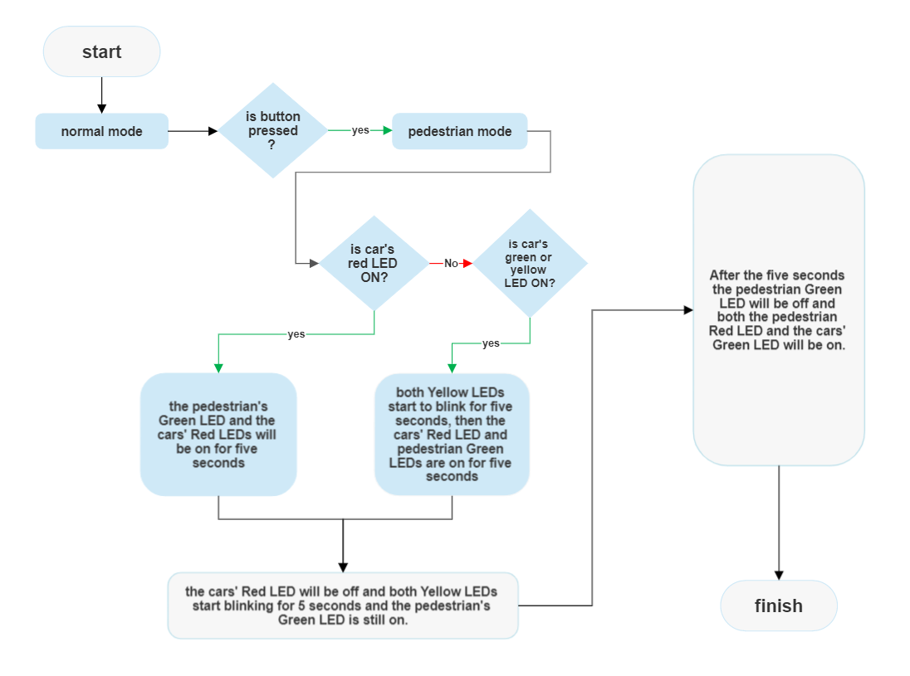

# On-demand Traffic light control
## for EgFWD Embedded Systems Professional Nanodegree Program

## System Description:

Traffic lights are signalling devices positioned at road 
intersections, pedestrian crossings, and other locations to 
control the flow of traffic.

Traffic lights normally consist of three signals, transmitting 
meaning to drivers and riders through colours and symbols 
including arrows and bicycles.

The regular traffic light colours are red, yellow, and green 
arranged vertically or horizontally in that order.

Although this is internationally standardized, variations exist 
on national and local scales as to traffic light sequences and 
laws.

You are required to implement a traffic lights system with an 
on-demand crosswalk button.

Crosswalk buttons let the signal operations know that 
someone is planning to cross the street, so the light adjusts, 
giving the pedestrian enough time to get across.

=========================================

## System Design:

### Hardware:
1. AVR ATmega 32.
2. Green and Yellow and Red LEDs.
3. Push Button.

### Software Design:

#### In normal mode:
1. Cars' LEDs will be changed every five seconds starting from 
Green then yellow then red then yellow then Green.
2. The Yellow LED will blink for five seconds before moving to 
Green or Red LEDs.

#### In pedestrian mode:
1. Change from normal mode to pedestrian mode when the 
pedestrian button is pressed.
2. If pressed when the cars' Red LED is on, the pedestrian's 
Green LED and the cars' Red LEDs will be on for five seconds, 
this means that pedestrians can cross the street while the 
pedestrian's Green LED is on.
3. If pressed when the cars' Green LED is on or the cars' Yellow 
LED is blinking, the pedestrian Red LED will be on then both 
Yellow LEDs start to blink for five seconds, then the cars' Red 
LED and pedestrian Green LEDs are on for five seconds, this 
means that pedestrian must wait until the Green LED is on.
4. At the end of the two states, the cars' Red LED will be off and 
both Yellow LEDs start blinking for 5 seconds and the 
pedestrian's Green LED is still on.
5. After the five seconds the pedestrian Green LED will be off,
and both the pedestrian Red LED and the cars' Green LED 
will be on.
6. Traffic lights signals are going to the normal mode again.
=========================================

### System Flowchart:

=========================================

### I used:
1. Eclipse IDE.
2. IMT AVR KIT.

=========================================

### check All Test cases and vedios:
check this link [All Test cases and vedios](https://drive.google.com/drive/folders/10Gs6iKOmVocc_phaXObsuxhRX1vvEbPB?usp=sharing)

=========================================

**Thanks for Reading**

